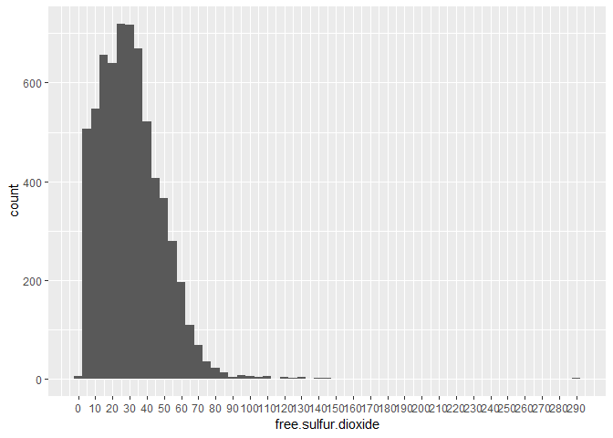
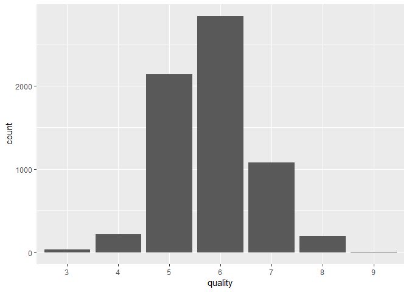
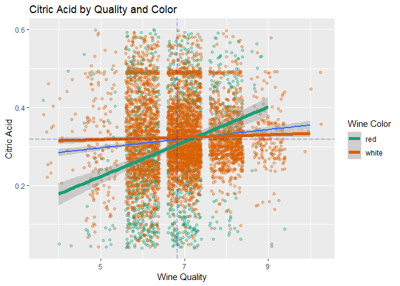
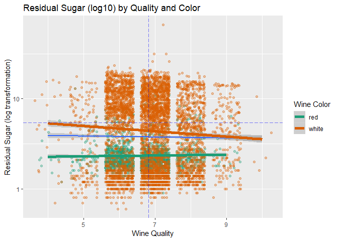

WINE QUALITY by Alex Presto
===========================

Abstract
--------

In this study, I describe several attributes of wine from two datasets -- one each for red and white wines -- and try to understand if any one or more attributes including the color of the wine can reliably predict the quality score.

About the Data
--------------

### Source

Created by: Paulo Cortez (Univ. Minho), Antonio Cerdeira, Fernando Almeida, Telmo Matos and Jose Reis (CVRVV) © 2009

### Attribute Information

For more information, read \[Cortez et al., 2009\].

#### Input variables (based on physicochemical tests):

1.  fixed acidity (tartaric acid - g / dm<sup>3</sup>)
2.  volatile acidity (acetic acid - g / dm<sup>3</sup>)
3.  citric acid (g / dm<sup>3</sup>)
4.  residual sugar (g / dm<sup>3</sup>)
5.  chlorides (sodium chloride - g / dm<sup>3</sup>)
6.  free sulfur dioxide (mg / dm<sup>3</sup>)
7.  total sulfur dioxide (mg / dm<sup>3</sup>)
8.  density (g / cm<sup>3</sup>)
9.  pH
10. sulphates (potassium sulphate - g / dm<sup>3</sup>)
11. alcohol (% by volume)

#### Output variable (based on sensory data):

1.  quality (score between 0 and 10)

The data is separated into two datasets found in files 'wineQualityReds.csv' and 'wineQualityWhites.csv' for red and white wines respectively. I will read them into dataframes 'red\_df' and 'white\_df' with the ultimate goal to combine them into a single dataframe 'wine\_df' where most of our analysis will take place.

Let's look at the first few rows of the 'red\_df' and 'white\_df' dataframes to see if we need to do any cleanup before combining.

``` r
# view first few lines of each dataframe.
head(red_df)
```

    ##     fixed.acidity volatile.acidity citric.acid residual.sugar chlorides
    ## 1 1           7.4             0.70        0.00            1.9     0.076
    ## 2 2           7.8             0.88        0.00            2.6     0.098
    ## 3 3           7.8             0.76        0.04            2.3     0.092
    ## 4 4          11.2             0.28        0.56            1.9     0.075
    ## 5 5           7.4             0.70        0.00            1.9     0.076
    ## 6 6           7.4             0.66        0.00            1.8     0.075
    ##   free.sulfur.dioxide total.sulfur.dioxide density   pH sulphates alcohol
    ## 1                  11                   34  0.9978 3.51      0.56     9.4
    ## 2                  25                   67  0.9968 3.20      0.68     9.8
    ## 3                  15                   54  0.9970 3.26      0.65     9.8
    ## 4                  17                   60  0.9980 3.16      0.58     9.8
    ## 5                  11                   34  0.9978 3.51      0.56     9.4
    ## 6                  13                   40  0.9978 3.51      0.56     9.4
    ##   quality
    ## 1       5
    ## 2       5
    ## 3       5
    ## 4       6
    ## 5       5
    ## 6       5

``` r
head(white_df)
```

    ##     fixed.acidity volatile.acidity citric.acid residual.sugar chlorides
    ## 1 1           7.0             0.27        0.36           20.7     0.045
    ## 2 2           6.3             0.30        0.34            1.6     0.049
    ## 3 3           8.1             0.28        0.40            6.9     0.050
    ## 4 4           7.2             0.23        0.32            8.5     0.058
    ## 5 5           7.2             0.23        0.32            8.5     0.058
    ## 6 6           8.1             0.28        0.40            6.9     0.050
    ##   free.sulfur.dioxide total.sulfur.dioxide density   pH sulphates alcohol
    ## 1                  45                  170  1.0010 3.00      0.45     8.8
    ## 2                  14                  132  0.9940 3.30      0.49     9.5
    ## 3                  30                   97  0.9951 3.26      0.44    10.1
    ## 4                  47                  186  0.9956 3.19      0.40     9.9
    ## 5                  47                  186  0.9956 3.19      0.40     9.9
    ## 6                  30                   97  0.9951 3.26      0.44    10.1
    ##   quality
    ## 1       6
    ## 2       6
    ## 3       6
    ## 4       6
    ## 5       6
    ## 6       6

It appears that the datasets for both red and white wine imported their row indices from the csv file. These are not required since new row indices were created during the import so we will delete them.

``` r
# remove first column which is just the index column from the original dataset
red_df <- red_df[,-1]
white_df <- white_df[,-1]
```

Let's check the structure of the dataframes after dropping the columns:

    ## 'data.frame':    1599 obs. of  12 variables:
    ##  $ fixed.acidity       : num  7.4 7.8 7.8 11.2 7.4 7.4 7.9 7.3 7.8 7.5 ...
    ##  $ volatile.acidity    : num  0.7 0.88 0.76 0.28 0.7 0.66 0.6 0.65 0.58 0.5 ...
    ##  $ citric.acid         : num  0 0 0.04 0.56 0 0 0.06 0 0.02 0.36 ...
    ##  $ residual.sugar      : num  1.9 2.6 2.3 1.9 1.9 1.8 1.6 1.2 2 6.1 ...
    ##  $ chlorides           : num  0.076 0.098 0.092 0.075 0.076 0.075 0.069 0.065 0.073 0.071 ...
    ##  $ free.sulfur.dioxide : num  11 25 15 17 11 13 15 15 9 17 ...
    ##  $ total.sulfur.dioxide: num  34 67 54 60 34 40 59 21 18 102 ...
    ##  $ density             : num  0.998 0.997 0.997 0.998 0.998 ...
    ##  $ pH                  : num  3.51 3.2 3.26 3.16 3.51 3.51 3.3 3.39 3.36 3.35 ...
    ##  $ sulphates           : num  0.56 0.68 0.65 0.58 0.56 0.56 0.46 0.47 0.57 0.8 ...
    ##  $ alcohol             : num  9.4 9.8 9.8 9.8 9.4 9.4 9.4 10 9.5 10.5 ...
    ##  $ quality             : int  5 5 5 6 5 5 5 7 7 5 ...

    ## 'data.frame':    4898 obs. of  12 variables:
    ##  $ fixed.acidity       : num  7 6.3 8.1 7.2 7.2 8.1 6.2 7 6.3 8.1 ...
    ##  $ volatile.acidity    : num  0.27 0.3 0.28 0.23 0.23 0.28 0.32 0.27 0.3 0.22 ...
    ##  $ citric.acid         : num  0.36 0.34 0.4 0.32 0.32 0.4 0.16 0.36 0.34 0.43 ...
    ##  $ residual.sugar      : num  20.7 1.6 6.9 8.5 8.5 6.9 7 20.7 1.6 1.5 ...
    ##  $ chlorides           : num  0.045 0.049 0.05 0.058 0.058 0.05 0.045 0.045 0.049 0.044 ...
    ##  $ free.sulfur.dioxide : num  45 14 30 47 47 30 30 45 14 28 ...
    ##  $ total.sulfur.dioxide: num  170 132 97 186 186 97 136 170 132 129 ...
    ##  $ density             : num  1.001 0.994 0.995 0.996 0.996 ...
    ##  $ pH                  : num  3 3.3 3.26 3.19 3.19 3.26 3.18 3 3.3 3.22 ...
    ##  $ sulphates           : num  0.45 0.49 0.44 0.4 0.4 0.44 0.47 0.45 0.49 0.45 ...
    ##  $ alcohol             : num  8.8 9.5 10.1 9.9 9.9 10.1 9.6 8.8 9.5 11 ...
    ##  $ quality             : int  6 6 6 6 6 6 6 6 6 6 ...

I want to combine these dataframes together to create a single dataframe 'wine\_df'. I want to be able to identify which records are red and which are white so before combining, I will create a 'color' column in each dataframe.

``` r
red_df$color <- 'red'
white_df$color <- 'white'

head(red_df, 2)
```

    ##   fixed.acidity volatile.acidity citric.acid residual.sugar chlorides
    ## 1           7.4             0.70           0            1.9     0.076
    ## 2           7.8             0.88           0            2.6     0.098
    ##   free.sulfur.dioxide total.sulfur.dioxide density   pH sulphates alcohol
    ## 1                  11                   34  0.9978 3.51      0.56     9.4
    ## 2                  25                   67  0.9968 3.20      0.68     9.8
    ##   quality color
    ## 1       5   red
    ## 2       5   red

``` r
head(white_df, 2)
```

    ##   fixed.acidity volatile.acidity citric.acid residual.sugar chlorides
    ## 1           7.0             0.27        0.36           20.7     0.045
    ## 2           6.3             0.30        0.34            1.6     0.049
    ##   free.sulfur.dioxide total.sulfur.dioxide density  pH sulphates alcohol
    ## 1                  45                  170   1.001 3.0      0.45     8.8
    ## 2                  14                  132   0.994 3.3      0.49     9.5
    ##   quality color
    ## 1       6 white
    ## 2       6 white

Both dataframes have the useless first columns removed and a 'color' column added. The number of columns are equal between the two and the column names are the same.

We can now combine these dataframes to a single dataframe called 'wine\_df'.

``` r
wine_df = rbind(red_df, white_df)
dim(wine_df)
```

    ## [1] 6497   13

``` r
dim(subset(wine_df, color == 'white'))
```

    ## [1] 4898   13

``` r
dim(subset(wine_df, color == 'red'))
```

    ## [1] 1599   13

``` r
names(red_df)
```

    ##  [1] "fixed.acidity"        "volatile.acidity"     "citric.acid"         
    ##  [4] "residual.sugar"       "chlorides"            "free.sulfur.dioxide" 
    ##  [7] "total.sulfur.dioxide" "density"              "pH"                  
    ## [10] "sulphates"            "alcohol"              "quality"             
    ## [13] "color"

``` r
names(white_df)
```

    ##  [1] "fixed.acidity"        "volatile.acidity"     "citric.acid"         
    ##  [4] "residual.sugar"       "chlorides"            "free.sulfur.dioxide" 
    ##  [7] "total.sulfur.dioxide" "density"              "pH"                  
    ## [10] "sulphates"            "alcohol"              "quality"             
    ## [13] "color"

``` r
names(wine_df)
```

    ##  [1] "fixed.acidity"        "volatile.acidity"     "citric.acid"         
    ##  [4] "residual.sugar"       "chlorides"            "free.sulfur.dioxide" 
    ##  [7] "total.sulfur.dioxide" "density"              "pH"                  
    ## [10] "sulphates"            "alcohol"              "quality"             
    ## [13] "color"

All datasets, including the combined dataset, now have equal number of variables and matching variables. We can begin our analysis starting with exploring Univariate Plots.

Univariate Plots Section
========================

Let's look the structure of the new dataframe again along with the summary:

    ## [1] 6497   13

    ## 'data.frame':    6497 obs. of  13 variables:
    ##  $ fixed.acidity       : num  7.4 7.8 7.8 11.2 7.4 7.4 7.9 7.3 7.8 7.5 ...
    ##  $ volatile.acidity    : num  0.7 0.88 0.76 0.28 0.7 0.66 0.6 0.65 0.58 0.5 ...
    ##  $ citric.acid         : num  0 0 0.04 0.56 0 0 0.06 0 0.02 0.36 ...
    ##  $ residual.sugar      : num  1.9 2.6 2.3 1.9 1.9 1.8 1.6 1.2 2 6.1 ...
    ##  $ chlorides           : num  0.076 0.098 0.092 0.075 0.076 0.075 0.069 0.065 0.073 0.071 ...
    ##  $ free.sulfur.dioxide : num  11 25 15 17 11 13 15 15 9 17 ...
    ##  $ total.sulfur.dioxide: num  34 67 54 60 34 40 59 21 18 102 ...
    ##  $ density             : num  0.998 0.997 0.997 0.998 0.998 ...
    ##  $ pH                  : num  3.51 3.2 3.26 3.16 3.51 3.51 3.3 3.39 3.36 3.35 ...
    ##  $ sulphates           : num  0.56 0.68 0.65 0.58 0.56 0.56 0.46 0.47 0.57 0.8 ...
    ##  $ alcohol             : num  9.4 9.8 9.8 9.8 9.4 9.4 9.4 10 9.5 10.5 ...
    ##  $ quality             : int  5 5 5 6 5 5 5 7 7 5 ...
    ##  $ color               : chr  "red" "red" "red" "red" ...

    ##  fixed.acidity    volatile.acidity  citric.acid     residual.sugar  
    ##  Min.   : 3.800   Min.   :0.0800   Min.   :0.0000   Min.   : 0.600  
    ##  1st Qu.: 6.400   1st Qu.:0.2300   1st Qu.:0.2500   1st Qu.: 1.800  
    ##  Median : 7.000   Median :0.2900   Median :0.3100   Median : 3.000  
    ##  Mean   : 7.215   Mean   :0.3397   Mean   :0.3186   Mean   : 5.443  
    ##  3rd Qu.: 7.700   3rd Qu.:0.4000   3rd Qu.:0.3900   3rd Qu.: 8.100  
    ##  Max.   :15.900   Max.   :1.5800   Max.   :1.6600   Max.   :65.800  
    ##    chlorides       free.sulfur.dioxide total.sulfur.dioxide
    ##  Min.   :0.00900   Min.   :  1.00      Min.   :  6.0       
    ##  1st Qu.:0.03800   1st Qu.: 17.00      1st Qu.: 77.0       
    ##  Median :0.04700   Median : 29.00      Median :118.0       
    ##  Mean   :0.05603   Mean   : 30.53      Mean   :115.7       
    ##  3rd Qu.:0.06500   3rd Qu.: 41.00      3rd Qu.:156.0       
    ##  Max.   :0.61100   Max.   :289.00      Max.   :440.0       
    ##     density             pH          sulphates         alcohol     
    ##  Min.   :0.9871   Min.   :2.720   Min.   :0.2200   Min.   : 8.00  
    ##  1st Qu.:0.9923   1st Qu.:3.110   1st Qu.:0.4300   1st Qu.: 9.50  
    ##  Median :0.9949   Median :3.210   Median :0.5100   Median :10.30  
    ##  Mean   :0.9947   Mean   :3.219   Mean   :0.5313   Mean   :10.49  
    ##  3rd Qu.:0.9970   3rd Qu.:3.320   3rd Qu.:0.6000   3rd Qu.:11.30  
    ##  Max.   :1.0390   Max.   :4.010   Max.   :2.0000   Max.   :14.90  
    ##     quality         color          
    ##  Min.   :3.000   Length:6497       
    ##  1st Qu.:5.000   Class :character  
    ##  Median :6.000   Mode  :character  
    ##  Mean   :5.818                     
    ##  3rd Qu.:6.000                     
    ##  Max.   :9.000

Our new dataset consists of 13 variables and 6,497 observations. With the summary information above in mind, let do some plotting to see if anything stands out,

Fixed Acidity (tartaric acid - g / dm<sup>3</sup>)
--------------------------------------------------

Most acids involved with wine or fixed or nonvolatile (do not evaporate readily).

    ##    Min. 1st Qu.  Median    Mean 3rd Qu.    Max. 
    ##   3.800   6.400   7.000   7.215   7.700  15.900

 <br> Fixed acidity has is 3.8 and 15.9 g/dm<sup>3</sup> has minimum and maximum values respectively. A mean and median that are fairly close but the 3rd quartile close at 7.7 g/dm<sup>3</sup> which is about half of the maximum value so it appears right-skewed. Lets see how it appears with a square root transformation.

 <br> This histogram looks better but still fairly long tailed towards the right. Looking just at this histogram, I estimate it may be possible to consider anything below 4.5 g/dm<sup>3</sup> and above 11 g/dm<sup>3</sup> as outliers.

I was wondering if there was a way I could calculate if any given point could be considered outliers given what we know about the measures of spread. Google searches led me to a definition of an outlier as " a point which falls more than 1.5 times the interquartile range above the third quartile or below the first quartile."

Source: <http://mathworld.wolfram.com/Outlier.html>

    ## Interquartile Range : 1.3 
    ##  1.5 times above the 3rd quartile : 9.65 
    ##  1.5 times below the 1st quartile : 4.45

Based on the above I was not off by much.

Volatile Acidity (acetic acid - g / dm<sup>3</sup>)
---------------------------------------------------

The amount of acetic acid in wine, which at too high of levels can lead to an unpleasant, vinegar taste.

    ##    Min. 1st Qu.  Median    Mean 3rd Qu.    Max. 
    ##  0.0800  0.2300  0.2900  0.3397  0.4000  1.5800

 <br> This histogram is skewed right which is to be expected since a higher volumn of volatile acidity will make the wine taste more like vinegar. I would expect that a negative correlation with quality later on but I'd be interested to know while color wine might be more volatile acidity compared to the other. Let's do a log10 transformation to see if anything stands out.


    ## Interquartile Range : 0.17 
    ##  1.5 times above the 3rd quartile : 0.655 
    ##  1.5 times below the 1st quartile : -0.025

<br>

Citric Acid (g / dm<sup>3</sup>)
================================

Found in small quantities, citric acid can add 'freshness' and flavor to wines.

    ##    Min. 1st Qu.  Median    Mean 3rd Qu.    Max. 
    ##  0.0000  0.2500  0.3100  0.3186  0.3900  1.6600

 <br> I wonder if this affects quality at all and which color wine. Is is supposed to add 'freshness' and flavor but does it correlate with other acidity values and do those correlate with with quality?

    ## Interquartile Range : 0.14 
    ##  1.5 times above the 3rd quartile : 0.6 
    ##  1.5 times below the 1st quartile : 0.04

Residual Sugar (g / dm<sup>3</sup>)
===================================

The amount of sugar remaining after fermentation stops, it's rare to find wines with less than 1 gram/liter and wines with greater than 45 grams/liter are considered sweet.

    ##    Min. 1st Qu.  Median    Mean 3rd Qu.    Max. 
    ##   0.600   1.800   3.000   5.443   8.100  65.800

 <br> I imagine most people have a sweet-tooth like me so, I wonder if this can correlate to higher quality scores. Which is generally sweeter? Red or White wine?

We can see it is skewed right which pulls the mean away quite significantly from the median. Let's look what a log10 transformation looks like.

 <br> After the transformation it looks quite bimodal with peaks around 2 g/dm<sup>3</sup> and 8 g/dm<sup>3</sup>. I wonder what it would look like if I separated the red and the white wines.


White wines' residual sugar histogram is bimodal with peaks around 1.3 g/dm<sup>3</sup> and 8 g/dm<sup>3</sup>. The sweetness of white wines can vary more than red wines.

    ## All wines IQR
    ##  Interquartile Range : 6.3 
    ##  1.5 times above the 3rd quartile : 9.84 
    ##  1.5 times below the 1st quartile : -9.2

    ##    Min. 1st Qu.  Median    Mean 3rd Qu.    Max. 
    ##   0.900   1.900   2.200   2.539   2.600  15.500

    ## 
    ## Red Wine IQR
    ##  Interquartile Range : 0.7 
    ##  1.5 times above the 3rd quartile : 3.65 
    ##  1.5 times below the 1st quartile : 0.85

    ##    Min. 1st Qu.  Median    Mean 3rd Qu.    Max. 
    ##   0.600   1.700   5.200   6.391   9.900  65.800

    ## 
    ## White Wine IQR
    ##  Interquartile Range : 8.2 
    ##  1.5 times above the 3rd quartile : 22.2 
    ##  1.5 times below the 1st quartile : -10.6

Chlorides (sodium chloride - g / dm<sup>3</sup>)
------------------------------------------------

The amount of salt in the wine.

    ##    Min. 1st Qu.  Median    Mean 3rd Qu.    Max. 
    ## 0.00900 0.03800 0.04700 0.05603 0.06500 0.61100

 <br> It is right skewed again as I suspect the saltier the wine the more it will suffer in quality.


    ## Interquartile Range : 0.027 
    ##  1.5 times above the 3rd quartile : 0.1055 
    ##  1.5 times below the 1st quartile : -0.0025

<br> The log transformation looks better but has a slight second peak at around 0.09 g/dm<sup>3</sup>.

Free Sulfur Dioxide (mg / dm<sup>3</sup>)
-----------------------------------------

The free form of SO**<sub>2</sub> exists in equilibrium between molecular SO**<sub>2</sub> (as a dissolved gas) and bisulfite ion; it prevents microbial growth and the oxidation of wine.

    ##    Min. 1st Qu.  Median    Mean 3rd Qu.    Max. 
    ##    1.00   17.00   29.00   30.53   41.00  289.00

 <br> From the histogram, free SO**<sub>2</sub> are mostly between 15 mg/dm<sup>3</sup> and 45 mg/dm<sup>3</sup> but exihibits a long tail right. Let's transform this is a square root function.


    ## Interquartile Range : 24 
    ##  1.5 times above the 3rd quartile : 77 
    ##  1.5 times below the 1st quartile : -19

Since the SO**<sub>2</sub> is a preventive measure to keep the wine from spoiling, I expect that quality is negatively correlated. A trade-off in some quality the more SO**<sub>2</sub> is found in wine. Does color affect the the amound in the wine?

Total Sulfur Dioxide (mg / dm<sup>3</sup>)
------------------------------------------

Amount of free and bound forms of SO**<sub>2</sub>; in low concentrations, SO**<sub>2</sub> is mostly undetectable in wine, but at free SO**<sub>2</sub> concentrations over 50 ppm, SO**<sub>2</sub> becomes evident in the nose and taste of wine.

    ##    Min. 1st Qu.  Median    Mean 3rd Qu.    Max. 
    ##     6.0    77.0   118.0   115.7   156.0   440.0

 <br> The histogram is bimodal and I wonder if color might be affecting it. Since, the information states that 50ppm of SO**<sub>2</sub> becomes eveident in the nose and taste of the wine, I would predict that the quality is negatively correlated with this attribute. I would also expect that Free Sulfer Dioxide and Total Sulfur Dioxide is positively correlated.

    ## Interquartile Range : 79 
    ##  1.5 times above the 3rd quartile : 274.5 
    ##  1.5 times below the 1st quartile : -41.5

Density (g / cm<sup>3</sup>)
----------------------------

The density of wine is close to that of water depending on the percent alcohol and sugar content.

Based on a quick google search, density of water is 997 kg/m<sup>3</sup> or 0.997 g/cm<sup>3</sup>.

    ##    Min. 1st Qu.  Median    Mean 3rd Qu.    Max. 
    ##  0.9871  0.9923  0.9949  0.9947  0.9970  1.0390

 <br> It seems quite obvious to anyone who's drunk wine, that it's density is just like water. The histogram appears to confirm that. I think that there could be a correlation between quality and density but I cannot not guess just yet if the correlation would be positive or negative. If I had to guess, I would imagine red wine to be more dense than white wine.

pH
--

Describes how acidic or basic a wine is on a scale from 0 (very acidic) to 14 (very basic); most wines are between 3-4 on the pH scale.

    ##    Min. 1st Qu.  Median    Mean 3rd Qu.    Max. 
    ##   2.720   3.110   3.210   3.219   3.320   4.010

 <br> This appears to be the most symmetrical of all the histograms. The mean and median are practically the same. I think that at the extreme ends of the histogram the quality of the wines begin to suffer.

    ## Interquartile Range : 0.21 
    ##  1.5 times above the 3rd quartile : 3.635 
    ##  1.5 times below the 1st quartile : 2.795

Sulphates (potassium sulphate - g / dm<sup>3</sup>)
---------------------------------------------------

A wine additive which can contribute to sulfur dioxide gas (S02) levels, which acts as an anti-microbial and antioxidant.

    ##    Min. 1st Qu.  Median    Mean 3rd Qu.    Max. 
    ##  0.2200  0.4300  0.5100  0.5313  0.6000  2.0000

 <br> As with the free and total sulfates attribute, this is right skewed. I would expect this to positively correlate with the free and total sulfates attribute while quality is negatively correlated.


    ## Interquartile Range : 0.17 
    ##  1.5 times above the 3rd quartile : 0.855 
    ##  1.5 times below the 1st quartile : 0.175

Alcohol (% by volume)
---------------------

The percent alcohol content of the wine.

    ##    Min. 1st Qu.  Median    Mean 3rd Qu.    Max. 
    ##    8.00    9.50   10.30   10.49   11.30   14.90

 <br> This histogram appears multi-modal and has a very high peak at around 9.5%. I'd be interested to see if wine colors have alcohol content.

Quality (score between 0 and 10)
--------------------------------

Output variable (based on sensory data). Scored between 0 and 10 points where 10 is the best score.

    ##  Factor w/ 11 levels "0","1","2","3",..: 6 6 6 7 6 6 6 8 8 6 ...

    ##    0    1    2    3    4    5    6    7    8    9   10 
    ##    0    0    0   30  216 2138 2836 1079  193    5    0

    ##    Min. 1st Qu.  Median    Mean 3rd Qu.    Max. 
    ##   4.000   6.000   7.000   6.818   7.000  10.000

 <br> The most common score is 6 with 2,836 wines with this grade. I wonder how this which of the two wine colors have a higher proportion of this grade.

Color
-----

"The color of wine is one of the most easily recognizable characteristics of wines. Color is also an element in wine tasting since heavy wines generally have a deeper color."

Source: <https://en.wikipedia.org/wiki/Wine_color>

    ## 
    ##   red white 
    ##  1599  4898

 <br> There are 1,599 red wines and 4,898 white wines in this dataframe. There may be a challenge later to compare the two since white wines has more than 3 times the number of red wines. I'll probably compare proportions later one instead of the count of wines.

Univariate Analysis
===================

### What is the structure of your dataset?

This dataset is a combination of the wine quality datasets for red and white wines. The total number of records in the combined dataset is 6,497 with 13 variables. Of these, 1,599 are red wine and 4,898 are white wine.

I had added a new column to distinguish color of the wine for each record.

### What is/are the main feature(s) of interest in your dataset?

Obviously the most important feature to me would be **quality**. As a buyer, I would love to be able to predict what of the 13 attributes in the dataset could reliably help me predict the quality of wine.

The next obvious feature, I think, is the **color** of the wine. Is the wine more likely to be enjoyed if it is red or white?

### What other features in the dataset do you think will help support your investigation into your feature(s) of interest?

Other features in the dataset that will suppport my investigation of the main features are attributes that involve acidity. I think it makes sense to see what these feature can do to affect quality since Tartaric Acid (**fixed.acidity**) plays in maintaining the chemical stability of the wine and its color and probably affects quality; Acetic Acid (**volatile.acidity**) is a produced as a product of the fermentation and as it increases, the vinegar taste also increases which I think will decrease the quality score; and Citric Acid (**citric.acid**) as these are added after the fermentation to add freshness and flavor to the wine.

I think Residual Sugar (**residual.sugar**) is another thing I will look into as I expect sweetness plays a role in the taste of the wine and therefore its quality.

Finally, I'd be interested if Alcohol (**alcohol**) plays any role in quality of the wines.

### Did you create any new variables from existing variables in the dataset?

Since red wine data and white wine data came from separate datasets, my combination of the two datasets necessitated my creation of a "color" attribute so I can identify records that are red or white wine.

### Of the features you investigated, were there any unusual distributions? Did you perform any operations on the data to tidy, adjust, or change the form of the data? If so, why did you do this?

Many of the features where skewed right like Volatile Acidity, Residual Sugar, Chlorides, Free Sulfure Dioxide, and Sulphates.

I performed either a log or a square root transformation on these depending on which one look closest to a normal distribution aftwards.

All the features I did this to looked closer to normal but Residual Sugar turned pretty much bimodal in the distribution for both log and square root transformation.

The reason I transformed the data is the hope that a more normal looking distribution can help me see a visual representation the measures of spread lot easier. Perhaps something will stand out if I did this like outliers being more easier to spot. These transformations will be helpful later when try to model and make predictions about the main features I am studying.

Bivariate Plots Section
=======================

Plot Matrix of interesting features
-----------------------------------

 <br> From the plot matrix above, it seems that we may need to convert the quality scores back to integers to see if we can ascertain any correlation.

We can also see that there are very few correlations that are moderate or better. Most can be considered either weak or no correlation. The only moderately correlated are positively correlated citric acid against fixed and volatile acidly and negatively correlated alcohol against residual sugar.

Fixed Acidity vs Quality
------------------------


    ## Correlation (Pearson Method): -0.1131983

<br> The scatter plot above is between quality and fixed acidity. I performed a log transformation on the y-axis and limited the y scale to exclude what we ascertained to be outliers in our univariate plots section.

There appears to be a weak negative correlation between quality and fixed acidity at -0.1131983 but if we look at just the red wines, there is a very weak positive correlation.

Volatile Acidity vs Quality
---------------------------


    ## Correlation (Pearson Method): -0.2100639

<br> Volatile acidity vs quality also displays a weak negative correlation.

Citric Acid vs Quality
----------------------


    ## Correlation (Pearson Method): 0.09575367

<br> Citric acid shows pretty much no correlation. Looking at only the red wines, there is appears to be a positive correlation but it is weak at best.

Residual Sugar vs Quality
-------------------------


    ## Correlation (Spearman Method): -0.01689059

<br> Given that, even after I log transformed the residual sugar attribute, the distribution appears bimodal, I opted to use the Spearman method.

There doesn't appear to be any correlation between residual sugar and quality.


    ## Correlation (Pearson Method): 0.03684778

<br> Even when I created a scatter plot for each wine color, no correlation presents itself.


    ## Correlation (Spearman Method): -0.08183041

<br>

Alcohol vs Quality
------------------


    ## Correlation (Spearman Method): 0.4469255

<br> The correlation between alcohol and quality appears to be positive and moderate.

Average quality of Red and White Wines
--------------------------------------

    ## The average quality score for all wine is 6.818378

    ## Red wine average quality is 6.636023 
    ##  white wine average quality is 6.877909

 <br> It looks like white wine on average get's higher quality scores. Let's look at the proportion of red and white wines which score at least the average quality of 6.818378.

 <br> It is quite clear that white wines on average have a higher proportion of at least the average quality score. Maybe the next section might be able to tell us why that is.

Bivariate Analysis
==================

### Talk about some of the relationships you observed in this part of the investigation. How did the feature(s) of interest vary with other features in the dataset?

Most correlations are weak at best for the chosen attributes versus quality. I have found some moderate correlation between citric acid and fixed and volatile acidity. For quality, only alcohol from the chosen attributes have a moderate correlation with it.

A larger proportion of white wines scores higher in quality compared to red wines.

### Did you observe any interesting relationships between the other features (not the main feature(s) of interest)?

I found it interesting that Residual Sugar didn't have any significant correlation with quality. Perhaps the next section can shed more light.

### What was the strongest relationship you found?

The strongest correlations is with alcohol content and quality. I expected that the taste would suffer as alcohol content increases.

Multivariate Plots Section
==========================

Since the strongest correlations so far is with Alcohol content vs Quality, look more closely at it here. Additionally, we found that white wines score better in quality so we ought to compare that too.

A moderate correlation also exists between residual sugar and alcohol so, although no correlation between residual sugar and quality has been observed yet, we'll take a look at that too.

I'm going to continue looking at citric acid as well because it is described as adding "freshness" and "flavor" despite it minute quantities in wine. There may be some thing I've overlooked.

 <br> I've decided to create a boxplot of quality scores against alcohol content as the visual may reveal someting. I think the plot above shows that generally alcohol content observered in wine increases as we go up the quality scores. The blue dashed line is the average alcohol content in all wines in the dataset.

Will this look differently between red and white wines?

 <br> When we look at the boxplot for each wine colors, it is more or less the same except that there tends to be more alcohol content in red wines.

 <br> The horizontal dashed line is the average alcohol content and the vertical dashed line is the average wine quality. We can see there is a moderate correlation with alcohol for both red and white wines. It looks like there is a higher proportion of red wines above the horizontal line which is consistent with what we've found so far.

<br>

    ## # A tibble: 4 x 2
    ##   alcohol.level mean_quality
    ##   <fct>                <dbl>
    ## 1 low                   6.36
    ## 2 medium                6.47
    ## 3 high                  6.85
    ## 4 very high             7.34

    ## # A tibble: 4 x 3
    ## # Groups:   alcohol.level [4]
    ##   alcohol.level color mean_quality
    ##   <fct>         <chr>        <dbl>
    ## 1 low           red           6.23
    ## 2 medium        red           6.38
    ## 3 high          red           6.75
    ## 4 very high     red           7.26

    ## # A tibble: 4 x 3
    ## # Groups:   alcohol.level [4]
    ##   alcohol.level color mean_quality
    ##   <fct>         <chr>        <dbl>
    ## 1 low           white         6.50
    ## 2 medium        white         6.57
    ## 3 high          white         6.94
    ## 4 very high     white         7.42

 <br> I categorized the alcohol levels based on their quartile percentage. I've assied an alcohol level of 'low' for alcohol that is less than 1st quartile number, 'medium' for greater than or equal to the 1st quartile but less than the median, 'high' for greater than or equal to the median but less than the 3rd quartile and 'very high' for everthing above the 3rd quartile.

In the all tables for all wines, red wine and white wines, the higher the alcohol levels are the higher the mean quality is.

 <br> The correlation between citric acid and quality appears weak at best but when we separate the red wines, a more moderate positive correlation appears. In the lower left quandrant of dashed lines we see more red wines while and the upper left quandrant there are more red wines also.

It could be possible that citric acid is a more common additive in red wines.

    ## # A tibble: 4 x 2
    ##   citric.acid.level mean_quality
    ##   <fct>                    <dbl>
    ## 1 low                       6.50
    ## 2 medium                    6.75
    ## 3 high                      6.94
    ## 4 very high                 6.82

    ## # A tibble: 4 x 5
    ## # Groups:   citric.acid.level [4]
    ##   citric.acid.level color mean_quality     n total_n
    ##   <fct>             <chr>        <dbl> <int>   <dbl>
    ## 1 low               red           6.45   767    1599
    ## 2 medium            red           6.46   155    1599
    ## 3 high              red           6.84   177    1599
    ## 4 very high         red           6.90   500    1599

    ## # A tibble: 4 x 5
    ## # Groups:   citric.acid.level [4]
    ##   citric.acid.level color mean_quality     n total_n
    ##   <fct>             <chr>        <dbl> <int>   <dbl>
    ## 1 low               white         6.54   847    4898
    ## 2 medium            white         7.05  1383    4898
    ## 3 high              white         7.03  1435    4898
    ## 4 very high         white         6.73  1233    4898

 <br> It looks like that citric acid does have a positive correlation with red wines, however I am not convinced it is even a moderate correlation. Perhaps further tests will shed light.

``` r
ggplot(aes(x = citric.acid.level, y = n/total_n), 
       data = mean_quality_citric_acid_level) +
  geom_col() +
  facet_wrap(~color) +
  xlab("Citric Acid Levels") +
  ylab("Proportion of total quantity ") +
  ggtitle("Proportion of Citric Acid Level for each Wine Color")
```

 <br> A very high proportion of red wines had a low levels of citric acid which goes against my intuition. Before this, it seemed convincing that higher citric acid levels, for red wines at least, could contribute to higher quality scores.

 <br> Here is another thing against my intuitions, a negative correlation with sugar content and quality scores. However, the correlation is quite weak and possibly non-existent. Let's test it further nonetheless.

    ## # A tibble: 4 x 2
    ##   residual.sugar.level mean_quality
    ##   <fct>                       <dbl>
    ## 1 low                          6.70
    ## 2 medium                       6.90
    ## 3 high                         6.78
    ## 4 very high                    6.78

    ## # A tibble: 4 x 3
    ## # Groups:   residual.sugar.level [4]
    ##   residual.sugar.level color mean_quality
    ##   <fct>                <chr>        <dbl>
    ## 1 low                  red           6.56
    ## 2 medium               red           6.65
    ## 3 high                 red           6.60
    ## 4 very high            red           6.81

    ## # A tibble: 4 x 3
    ## # Groups:   residual.sugar.level [4]
    ##   residual.sugar.level color mean_quality
    ##   <fct>                <chr>        <dbl>
    ## 1 low                  white         6.83
    ## 2 medium               white         7.14
    ## 3 high                 white         6.95
    ## 4 very high            white         6.75

 <br> Although there is a slight positive correlation with red wines in terms of residual sugar levels and quality, overall there is no correlation to speak of at this point.

 <br> There appears to be be a negative relationship between sugar and alcohol. For all citric acid levels, there is comparable rates of decline in sugar and alcohol increases. This correlation looks weak though.

 <br> There appears to be a slower rate of increase in citric acid along with residual sugar. It does seem to follow that citric acid does decrease as alcohol levels increase which probably means that citric acid levels lower as quality scores go up.

 <br> No correlation between alcohol and citric acid here.

 <br> The downward trend for residual sugar against alcohol seems more apparent in white wines.

 <br> Alcohol is still the strongest predictor of quality for both red and white wines.

 <br> No discernable pattern here as far as I can see.

``` r
m1 <- lm(as.numeric(quality) ~ alcohol, data = wine_df)
m2 <- update(m1, ~ . + citric.acid)
m3 <- update(m2, ~ . + I(sqrt(fixed.acidity)))
m4 <- update(m3, ~ . + I(log10(volatile.acidity)))
m5 <- update(m4, ~ . + I(log10(residual.sugar)))
mtable(m1, m2, m3, m4, m5, sdigits = 3)
```

    ## 
    ## Calls:
    ## m1: lm(formula = as.numeric(quality) ~ alcohol, data = wine_df)
    ## m2: lm(formula = as.numeric(quality) ~ alcohol + citric.acid, data = wine_df)
    ## m3: lm(formula = as.numeric(quality) ~ alcohol + citric.acid + I(sqrt(fixed.acidity)), 
    ##     data = wine_df)
    ## m4: lm(formula = as.numeric(quality) ~ alcohol + citric.acid + I(sqrt(fixed.acidity)) + 
    ##     I(log10(volatile.acidity)), data = wine_df)
    ## m5: lm(formula = as.numeric(quality) ~ alcohol + citric.acid + I(sqrt(fixed.acidity)) + 
    ##     I(log10(volatile.acidity)) + I(log10(residual.sugar)), data = wine_df)
    ## 
    ## ====================================================================================================
    ##                                    m1            m2            m3            m4            m5       
    ## ----------------------------------------------------------------------------------------------------
    ##   (Intercept)                     3.405***      3.225***      3.971***      2.577***      2.014***  
    ##                                  (0.086)       (0.088)       (0.150)       (0.159)       (0.168)    
    ##   alcohol                         0.325***      0.326***      0.321***      0.323***      0.349***  
    ##                                  (0.008)       (0.008)       (0.008)       (0.008)       (0.008)    
    ##   citric.acid                                   0.542***      0.680***     -0.024        -0.131     
    ##                                                (0.066)       (0.070)       (0.075)       (0.075)    
    ##   I(sqrt(fixed.acidity))                                     -0.274***      0.092*        0.161***  
    ##                                                              (0.045)       (0.046)       (0.047)    
    ##   I(log10(volatile.acidity))                                               -1.192***     -1.173***  
    ##                                                                            (0.056)       (0.055)    
    ##   I(log10(residual.sugar))                                                                0.256***  
    ##                                                                                          (0.027)    
    ## ----------------------------------------------------------------------------------------------------
    ##   R-squared                       0.197         0.206         0.210         0.262         0.273     
    ##   adj. R-squared                  0.197         0.205         0.210         0.262         0.272     
    ##   sigma                           0.782         0.778         0.776         0.750         0.745     
    ##   F                            1597.641       840.129       575.744       576.716       486.465     
    ##   p                               0.000         0.000         0.000         0.000         0.000     
    ##   Log-likelihood              -7623.404     -7590.306     -7571.586     -7350.109     -7303.980     
    ##   Deviance                     3975.734      3935.432      3912.819      3654.940      3603.407     
    ##   AIC                         15252.809     15188.612     15153.172     14712.218     14621.960     
    ##   BIC                         15273.146     15215.728     15187.068     14752.893     14669.414     
    ##   N                            6497          6497          6497          6497          6497         
    ## ====================================================================================================

<br> The models show quite weak correlation with the selected attributes.

``` r
m1 <- lm(as.numeric(quality) ~ alcohol, data = subset(wine_df, color == 'red'))
m2 <- update(m1, ~ . + citric.acid)
m3 <- update(m2, ~ . + I(sqrt(fixed.acidity)))
m4 <- update(m3, ~ . + I(log10(volatile.acidity)))
m5 <- update(m4, ~ . + I(log10(residual.sugar)))
mtable(m1, m2, m3, m4, m5, sdigits = 3)
```

    ## 
    ## Calls:
    ## m1: lm(formula = as.numeric(quality) ~ alcohol, data = subset(wine_df, 
    ##     color == "red"))
    ## m2: lm(formula = as.numeric(quality) ~ alcohol + citric.acid, data = subset(wine_df, 
    ##     color == "red"))
    ## m3: lm(formula = as.numeric(quality) ~ alcohol + citric.acid + I(sqrt(fixed.acidity)), 
    ##     data = subset(wine_df, color == "red"))
    ## m4: lm(formula = as.numeric(quality) ~ alcohol + citric.acid + I(sqrt(fixed.acidity)) + 
    ##     I(log10(volatile.acidity)), data = subset(wine_df, color == 
    ##     "red"))
    ## m5: lm(formula = as.numeric(quality) ~ alcohol + citric.acid + I(sqrt(fixed.acidity)) + 
    ##     I(log10(volatile.acidity)) + I(log10(residual.sugar)), data = subset(wine_df, 
    ##     color == "red"))
    ## 
    ## ====================================================================================================
    ##                                    m1            m2            m3            m4            m5       
    ## ----------------------------------------------------------------------------------------------------
    ##   (Intercept)                     2.875***      2.830***      2.225***      1.908***      1.911***  
    ##                                  (0.175)       (0.171)       (0.302)       (0.291)       (0.291)    
    ##   alcohol                         0.361***      0.346***      0.355***      0.322***      0.323***  
    ##                                  (0.017)       (0.016)       (0.017)       (0.016)       (0.016)    
    ##   citric.acid                                   0.730***      0.524***     -0.307*       -0.300*    
    ##                                                (0.090)       (0.124)       (0.138)       (0.140)    
    ##   I(sqrt(fixed.acidity))                                      0.199*        0.339***      0.341***  
    ##                                                              (0.082)       (0.080)       (0.080)    
    ##   I(log10(volatile.acidity))                                               -1.595***     -1.586***  
    ##                                                                            (0.136)       (0.138)    
    ##   I(log10(residual.sugar))                                                               -0.043     
    ##                                                                                          (0.112)    
    ## ----------------------------------------------------------------------------------------------------
    ##   R-squared                       0.227         0.257         0.260         0.319         0.319     
    ##   adj. R-squared                  0.226         0.256         0.259         0.317         0.317     
    ##   sigma                           0.710         0.696         0.695         0.667         0.668     
    ##   F                             468.267       276.595       186.933       186.559       149.198     
    ##   p                               0.000         0.000         0.000         0.000         0.000     
    ##   Log-likelihood              -1721.057     -1688.711     -1685.755     -1619.622     -1619.547     
    ##   Deviance                      805.870       773.917       771.062       709.847       709.781     
    ##   AIC                          3448.114      3385.421      3381.511      3251.243      3253.093     
    ##   BIC                          3464.245      3406.930      3408.396      3283.506      3290.733     
    ##   N                            1599          1599          1599          1599          1599         
    ## ====================================================================================================

The models for the red wine subset show quite weak correlation with the selected attributes however it seem stronger from models m4 and m5. Possibly slightly moderate strength.

``` r
m1 <- lm(as.numeric(quality) ~ alcohol, data = subset(wine_df, color == 'white'))
m2 <- update(m1, ~ . + citric.acid)
m3 <- update(m2, ~ . + I(sqrt(fixed.acidity)))
m4 <- update(m3, ~ . + I(log10(volatile.acidity)))
m5 <- update(m4, ~ . + I(log10(residual.sugar)))
mtable(m1, m2, m3, m4, m5, sdigits = 3)
```

    ## 
    ## Calls:
    ## m1: lm(formula = as.numeric(quality) ~ alcohol, data = subset(wine_df, 
    ##     color == "white"))
    ## m2: lm(formula = as.numeric(quality) ~ alcohol + citric.acid, data = subset(wine_df, 
    ##     color == "white"))
    ## m3: lm(formula = as.numeric(quality) ~ alcohol + citric.acid + I(sqrt(fixed.acidity)), 
    ##     data = subset(wine_df, color == "white"))
    ## m4: lm(formula = as.numeric(quality) ~ alcohol + citric.acid + I(sqrt(fixed.acidity)) + 
    ##     I(log10(volatile.acidity)), data = subset(wine_df, color == 
    ##     "white"))
    ## m5: lm(formula = as.numeric(quality) ~ alcohol + citric.acid + I(sqrt(fixed.acidity)) + 
    ##     I(log10(volatile.acidity)) + I(log10(residual.sugar)), data = subset(wine_df, 
    ##     color == "white"))
    ## 
    ## ====================================================================================================
    ##                                    m1            m2            m3            m4            m5       
    ## ----------------------------------------------------------------------------------------------------
    ##   (Intercept)                     3.582***      3.510***      4.537***      3.653***      2.863***  
    ##                                  (0.098)       (0.105)       (0.223)       (0.222)       (0.227)    
    ##   alcohol                         0.313***      0.315***      0.309***      0.319***      0.368***  
    ##                                  (0.009)       (0.009)       (0.009)       (0.009)       (0.010)    
    ##   citric.acid                                   0.175         0.321**       0.099         0.037     
    ##                                                (0.094)       (0.098)       (0.096)       (0.094)    
    ##   I(sqrt(fixed.acidity))                                     -0.390***     -0.368***     -0.384***  
    ##                                                              (0.075)       (0.073)       (0.071)    
    ##   I(log10(volatile.acidity))                                               -1.370***     -1.529***  
    ##                                                                            (0.076)       (0.076)    
    ##   I(log10(residual.sugar))                                                                0.381***  
    ##                                                                                          (0.030)    
    ## ----------------------------------------------------------------------------------------------------
    ##   R-squared                       0.190         0.190         0.195         0.245         0.270     
    ##   adj. R-squared                  0.190         0.190         0.194         0.245         0.269     
    ##   sigma                           0.797         0.797         0.795         0.770         0.757     
    ##   F                            1146.395       575.202       394.569       397.619       361.134     
    ##   p                               0.000         0.000         0.000         0.000         0.000     
    ##   Log-likelihood              -5839.391     -5837.672     -5824.121     -5665.343     -5585.242     
    ##   Deviance                     3112.257      3110.073      3092.911      2898.748      2805.471     
    ##   AIC                         11684.782     11683.344     11658.241     11342.685     11184.485     
    ##   BIC                         11704.272     11709.331     11690.724     11381.665     11229.961     
    ##   N                            4898          4898          4898          4898          4898         
    ## ====================================================================================================

The models for the white wine subset goes back to being quite weak.

Multivariate Analysis
=====================

### Talk about some of the relationships you observed in this part of the investigation. Were there features that strengthened each other in terms of looking at your feature(s) of interest?

In this study the best indicator of quality is the alcohol content but even then it is only a moderate correlation at best. When I looked at other attributes that based intuition alone felt like would be strong indicators of quality, I found either none or weak correlations only. For example, fixed acidity and volatile acidity based on their definitions should have a negative correlation but not could be observed from the dataset. Citric Acid, is an additive after fermentation is complete to add 'freshness' and flavor but no significant correlation could be found.

However, some correlations better than weak could be observed against alcohol like Citric acid levels. The low levels of citric acid appears to have a moderate negative correlation with alcohol. So I would assume that the lower the citric acid levels the more likely the the quality to be higher.

### Were there any interesting or surprising interactions between features?

I found it interesting that as fixed and volatile acidity increase, there is a negative correlation with citric acid. Additional, if we look at higher alcohol content the quality increases but higher quality content suggest lower citric acid therefore higher fixed and volatile acidity?

### OPTIONAL: Did you create any models with your dataset? Discuss the strengths and limitations of your model.

I created some linear models. The R-square values were pretty weak across all models. I think modeling for anything where the values are not measurable and reproducable but a subjected opinion, you will not get a very strong correlations. There is no way of knowing if the quality scores where given in by a single person, a team of people, strangers from around the world, what the person sick, was she a professional? Could weather or season play a part in the scores?

There are just too many factors that cannot be accounted for when the values are from human sensory data that has too many biases and external influences.

------------------------------------------------------------------------

Final Plots and Summary
=======================

### Plot One


### Description One

I think a simple boxplot shows quite clearly that wines that scores higher has a higher alcohol content regardless of what color wine it is.

### Plot Two


### Description Two

As seen here, a clear relationship exists between Alcohol and Quality regardless of wine color. The relationship looks moderate in strength. It is the strongest relationship between any attribute quality I could find despite only being a moderately strong relationship at best.

### Plot Three


### Description Three

Going against my intuition, it seems that residual sugar has a negative relationship with alcohol. I am predicting that while alcohol makes the wine better, the wine is actually getting less sweet. Additional, if you look at the regression line fitted for low levels of Citric Acid, I find that the scatter points closely fit the line compared to the higher levels of citric acid. Not only is wine better with more alcohol, it is better when it is less sweet and less citric acid (less flavor and freshness).

------------------------------------------------------------------------

Reflection
==========

Okay, so we have better than moderate chance of getting a good wine when we pick one with a higher alcohol content. However, if we want it sweeter or fruitier (fresh and flavorful), it won't be as good.

Although correlation is easier to ascertain with alcohol than with other attributes, I found it pretty easy to make correlations between attributes with little to no correlation to quality and alcohol. So I drew conclusions from there.

I think this kind of study suffers from a key attribute being a the result of totally bias personal opinion of the drinker. Also, I have found in my research outside of the dataset, that wine experts and regular and experienced wine drinkers cannot distinguish expensive wine from cheap wine, red wine from white wine that are dyed red and even external factors like what music you are listening to can affect the way perceive and enjoy the wine you are drinking.

You can read about these things <a href="https://www.theguardian.com/lifeandstyle/2013/jun/23/wine-tasting-junk-science-analysis">here</a>, <a href="https://www.sciencedirect.com/science/article/pii/S0093934X01924939">here</a>, <a href="https://www.theguardian.com/science/2011/apr/14/expensive-wine-cheap-plonk-taste">here</a>, <a href="http://ageconsearch.umn.edu/record/37328">here</a>, and <a href="https://www.decanter.com/wine-news/montes-music-makes-wine-reach-parts-it-otherwise-couldnt-reach-82325/">here</a>.

With my analysis and the articles I encountered in my study,I think that no one can really know what makes a wine better from the other by opinion alone and the attribution of quality scores are arbitrary at best. A reason a moderate correlation exist between alcohol and quality is the higher alcohol bring about inebriation faster cause a higher (albeit totally biased) score.
